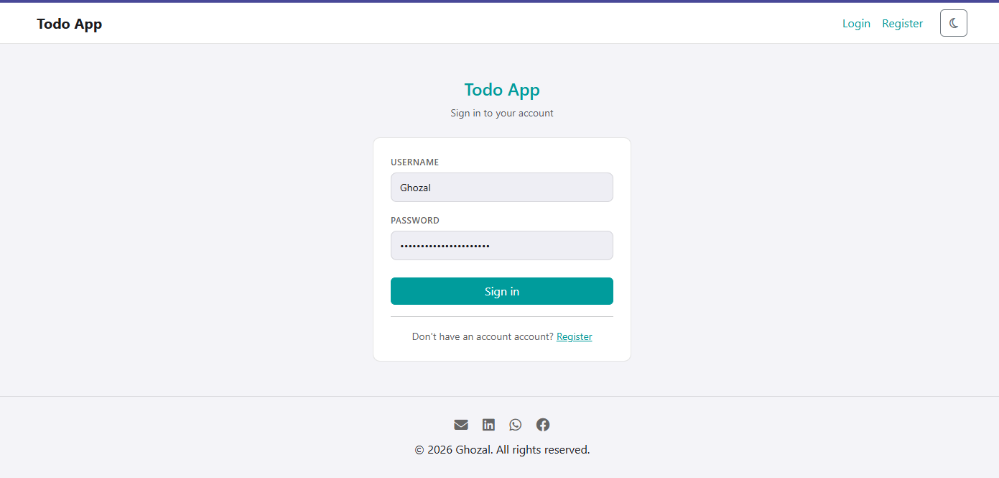
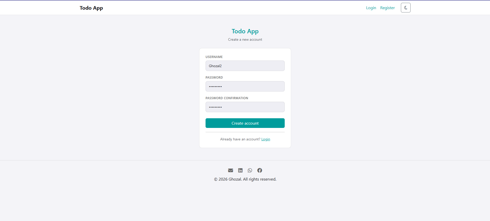
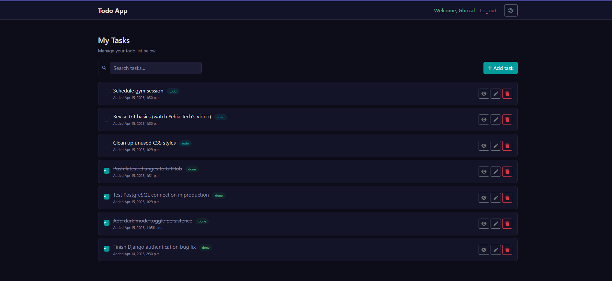
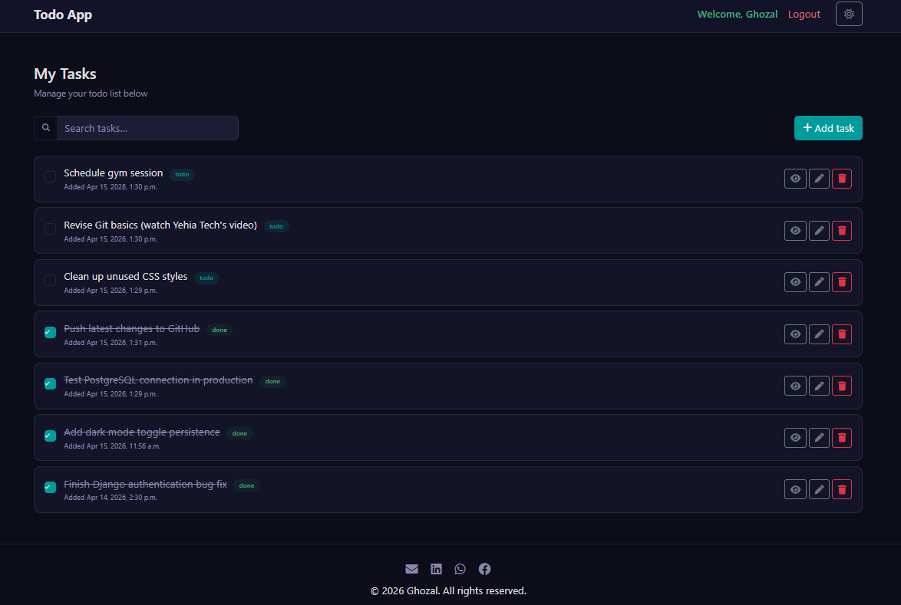

# 📝 Django Todo App

A backend-driven Todo application built using Django with secure authentication and PostgreSQL integration.

---

## 🚀 Features

- User authentication (Register / Login / Logout)
- Secure password hashing using Argon2
- Task management (Create, Update, Delete)
- PostgreSQL database integration
- Dark mode support 🌙
- Clean and structured backend architecture

---

## 🛠️ Tech Stack

- Python
- Django
- PostgreSQL

---

## 📸 Screenshots

> (Add your screenshots here)

### 🔐 Authentication



### 📋 Task Dashboard (Light Mode)


### 🌙 Task Dashboard (Dark Mode)


---

## ⚙️ Run Locally

```bash
git clone https://github.com/MarwanGhozal/django-todo-app.git
cd django-todo-app

pip install -r requirements.txt
python manage.py migrate
python manage.py runserver


## 🔐 Environment Variables

Create a .env file in the root directory and add:

DB_NAME=your_db_name
DB_USER=your_user
DB_PASSWORD=your_password
DB_HOST=localhost
DB_PORT=5432

## 📚 Learning Resources

This project was inspired and guided by:

Programming with Mosh
Dennis Ivy

## 📌 Notes

This project was only built as part of my backend learning journey to strengthen my understanding of Django, authentication systems, and database integration.
